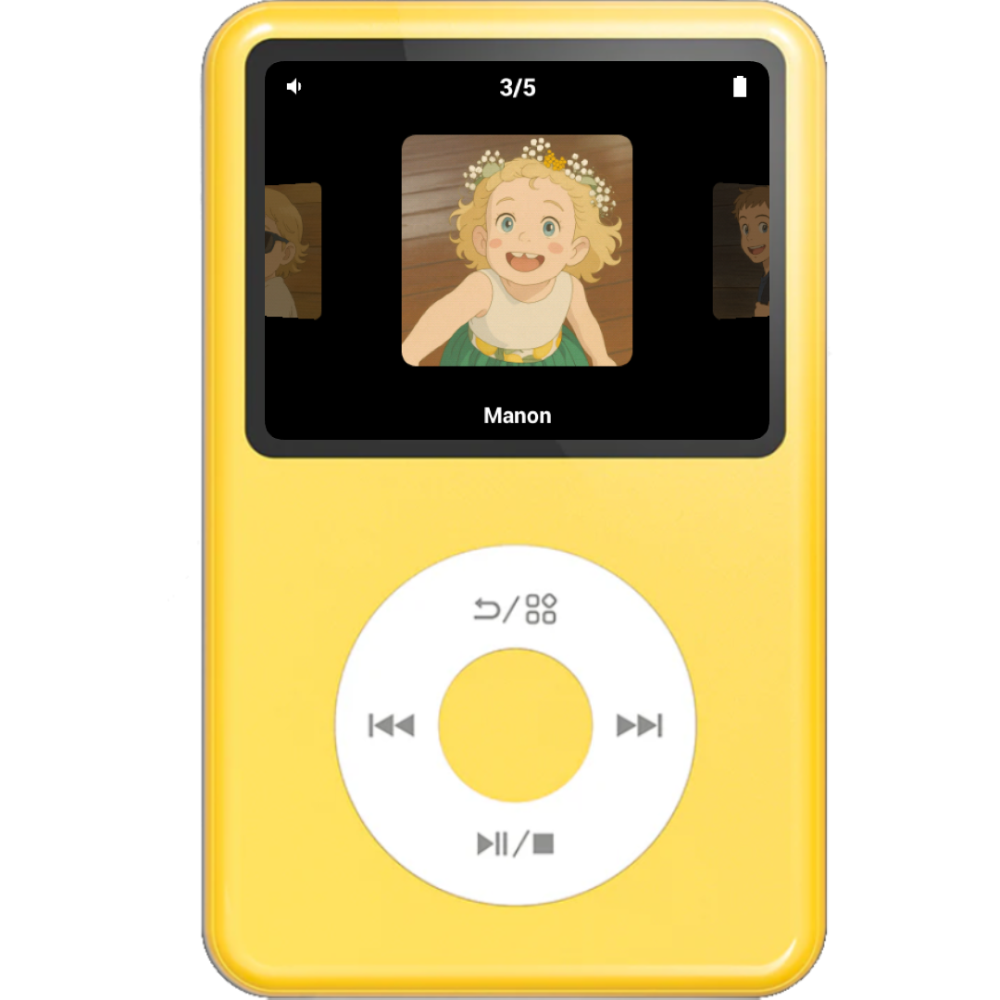
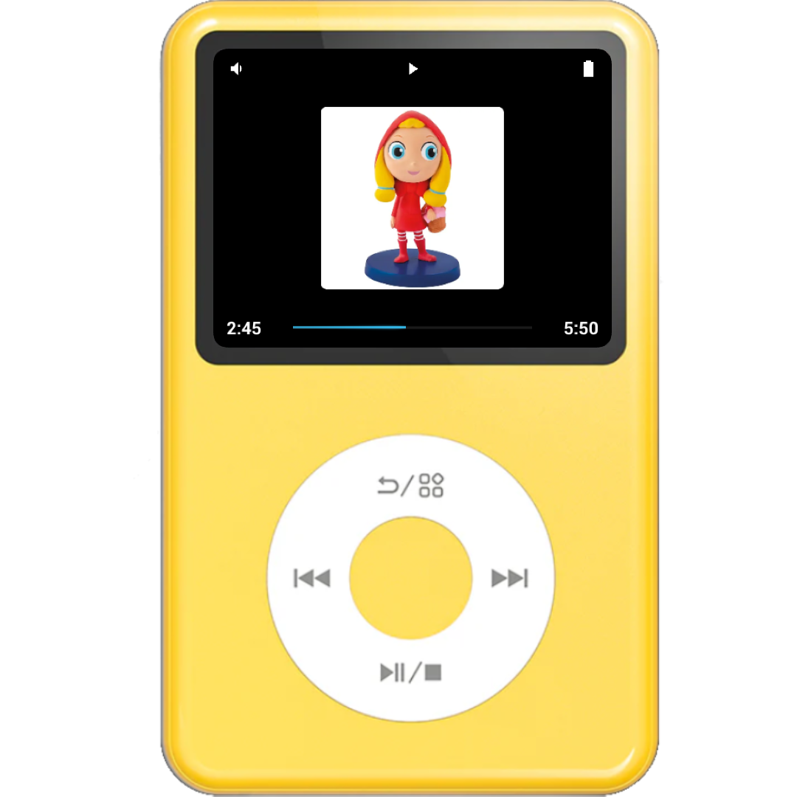
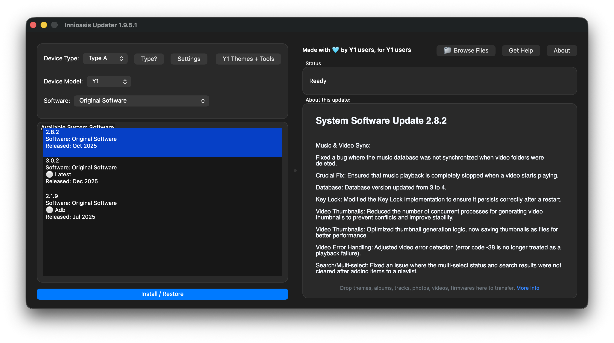
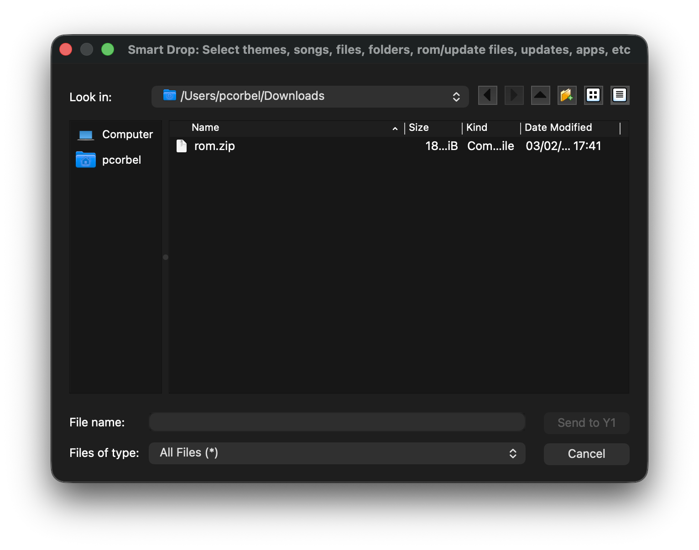
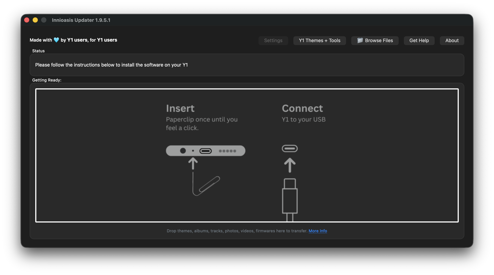
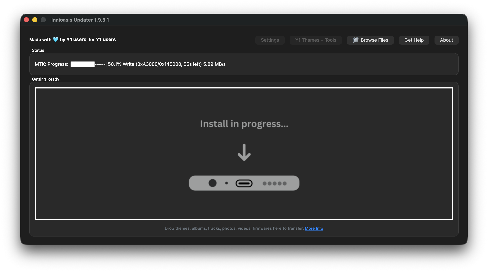

  

    <h1 class="hero-title">Kidz-Y1</h1>
    
A simple MP3 player designed for kids

  

  <section class="intro-section">
    <h2>What is Kidz-Y1?</h2>
    
Kidz-Y1 is a kid-friendly mp3 player for Innioasis Y1 devices. You don't need to create playlists or add special information to your music files. Just put your music files in folders on your device, and the app will show them the same way you organized them.

    
    

      

        
🎧

        <h3>Simple for Kids</h3>
        
Kids who want a simple way to listen to music

      

      

        
👨‍👩‍👧‍👦

        <h3>Parent-Friendly</h3>
        
Parents organizing music by child or theme

      

      

        
📚

        <h3>Educational</h3>
        
Educational content organized by subject or story

      

      

        
🔈

        <h3>Audiobooks</h3>
        
Audiobooks and stories organized by series

      

    

  </section>

  <section class="images-section">
    <h2>📸 Screenshots</h2>
    

      

        
        
Browse your music with the coverflow view

      

      

        
        
Enjoy your music with an intuitive player interface

      

    

  </section>

  <section class="installation-section">
    <h2>📥 Installation</h2>
    <ol>
      <li><strong>Download the latest ROM</strong> — Get the latest <code>rom.zip</code> from <a href="https://github.com/pcorbel/kidz-y1/releases/latest">GitHub Releases</a>.</li>
      <li><strong>Install with the Innioasis Updater</strong> — Use the official <a href="https://innioasis.app/">Innioasis Updater</a> app and follow these steps:</li>
    </ol>
    

      

        
<strong>1°)</strong> Open the Innioasis Updater app.

        
      

      

        
<strong>2°)</strong> Select the <code>rom.zip</code> you previously downloaded.

        
      

      

        
<strong>3°)</strong> Connect your Y1 device.

        
      

      

        
<strong>4°)</strong> Wait for the install to complete.

        
      

      

        
<strong>5°)</strong> Done — enjoy!

      

    

  </section>

  <section class="switching-section">
    <h2>🔄 Switching Between Apps</h2>
    
You can switch between the Stock launcher and Kidz by pressing and holding the back button for 5 seconds. This allows you to easily access the full Stock interface when needed, while keeping the simple Kidz interface as the one for kids.

  </section>

  <section class="organization-section">
    <h2>📁 How to Organize Your Music</h2>
    
    <h3>Folder Structure</h3>
    
The app looks for files in a simple three-level folder structure:

    
    

      <pre><code>/sdcard/Kidz/
  ├── Alice/              ← Profile folder
  │   ├── Stories/        ← Album folder
  │   │   ├── Story1.mp3  ← MP3 file
  │   │   ├── Story2.mp3
  │   │   └── Story3.mp3
  │   └── Songs/
  │       └── Song1.mp3
  └── Bob/
      └── Stories/
          └── Story1.mp3</code></pre>
    

    <h3>Adding Images</h3>
    
You can add pictures to show as covers for your music. The app looks for image files with the same name as your folders or music files. Here's how:

    
<strong>Supported picture file types:</strong> PNG or JPG files

    

      

        <h4>📷 Pictures for Profiles</h4>
        
Put a picture file next to the profile's folder with the same name.  For example, if you have a folder called "Alice", put a picture called "Alice.png" or "Alice.jpg" next to it.

        

          <pre><code>/sdcard/Kidz/

├── Alice.png ← Picture for Alice
├── Alice/ ← Alice's music folder
│ └── ...
├── Bob.jpg ← Picture for Bob
└── Bob/ ← Bob's music folder
└── ...</code></pre>

      

        <h4>📷 Pictures for Albums</h4>
        
Put a picture file next to the album folder with the same name.  For example, if you have an album folder called "Stories", put a picture called "Stories.png" or "Stories.jpg" next to it.

        

          <pre><code>Alice/

├── Stories.png ← Picture for Stories album
├── Stories/ ← Stories album folder
│ ├── Story1.mp3
│ └── Story2.mp3
└── Songs/ ← Songs album folder
└── Song1.mp3</code></pre>

      

        <h4>📷 Pictures for Individual Music Files</h4>
        
Put a picture file <strong>next to</strong> the music file with the <strong>same name</strong> (but without the .mp3 part).  For example, if you have "Story1.mp3", put a picture called "Story1.png" or "Story1.jpg" next to it.

        

          <pre><code>Stories/

├── Story1.mp3
├── Story1.png ← Picture for Story1
├── Story2.mp3
└── Story2.jpg ← Picture for Story2</code></pre>

  </section>

  <section class="footer-section">
    <h2>📄 License</h2>
    
See <a href="https://github.com/pcorbel/kidz-y1/blob/main/LICENSE">LICENSE</a> file for details.

    
    <h2>🤝 Contributing</h2>
    
Contributions are welcome! Please feel free to submit issues or pull requests.

    
    

      
<strong>Made with ❤️ for kids who love music and stories</strong>

    

  </section>

